# crud-weather-react-app
The intention of this project is to test the technologies studied:
ux/ui design in figma
react
Redux applied to login, errors, loading
Mui using break points.
Access to weather endpoint
Crud on a java server implemented jwt and argon2.

The project is in the review stage.

figma first approach
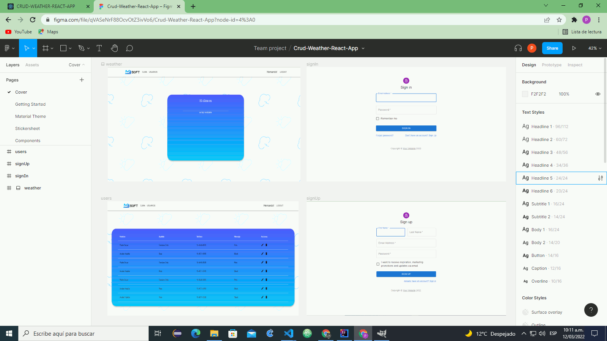

register
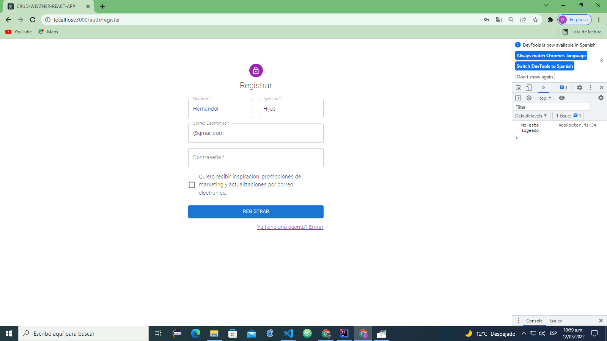

loggin
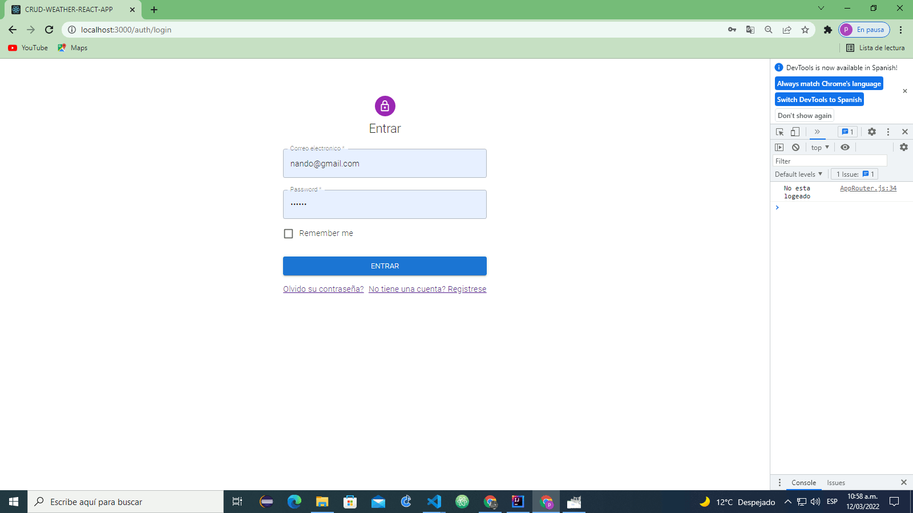

weather desktop
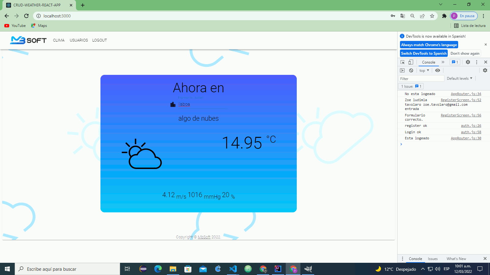

weather nokia9
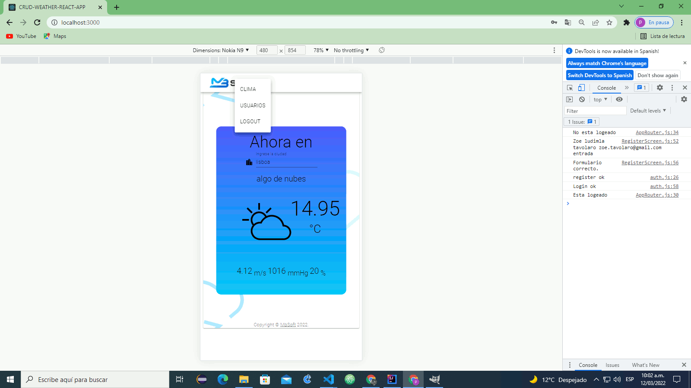

crud desktop
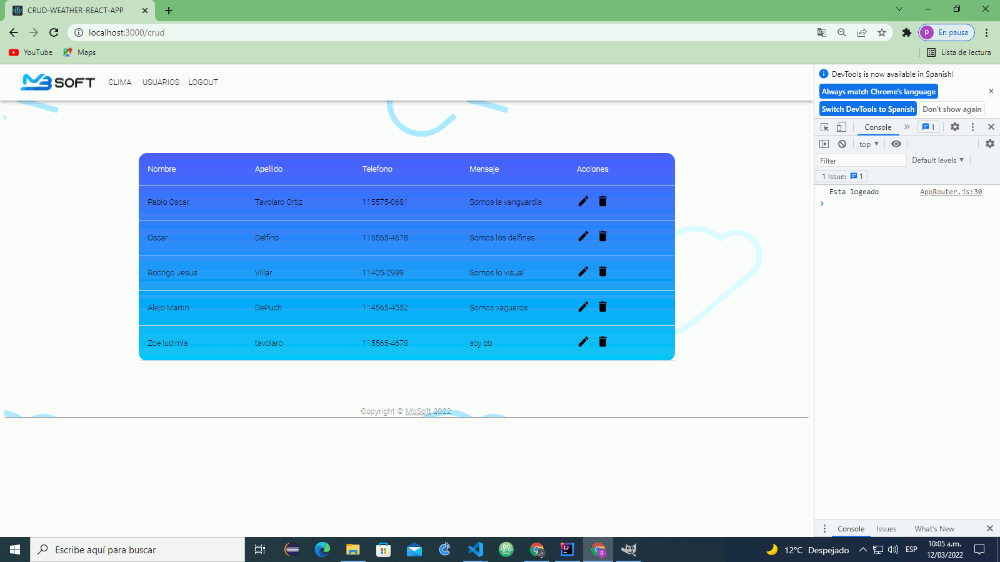

crud edit
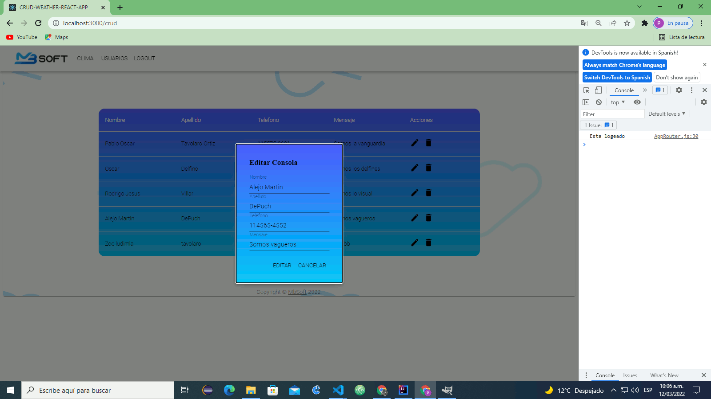

crud nokia9
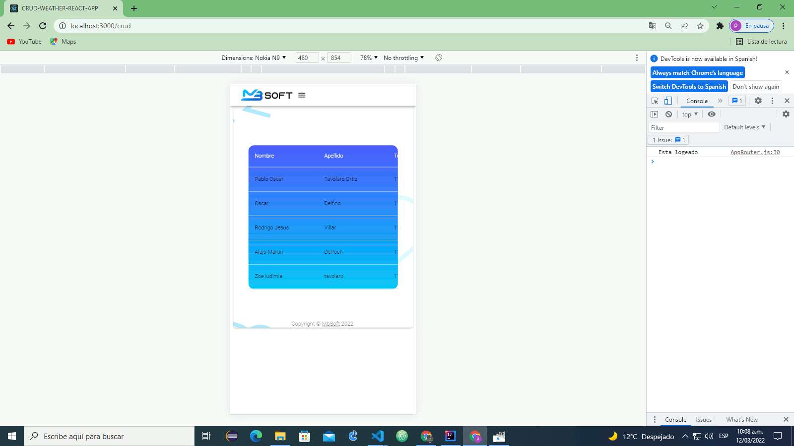

crud nokia9 table scroll
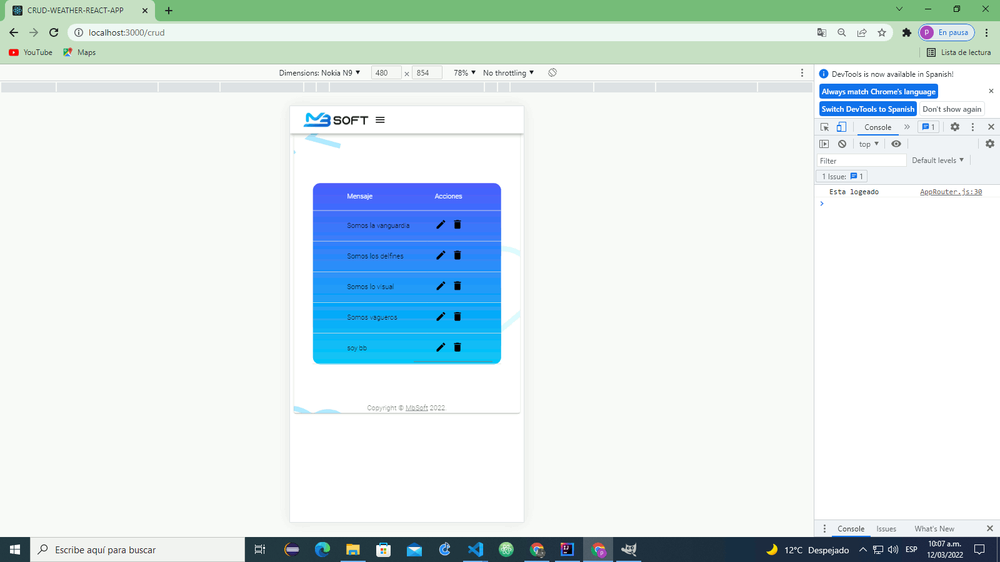

alert message ok
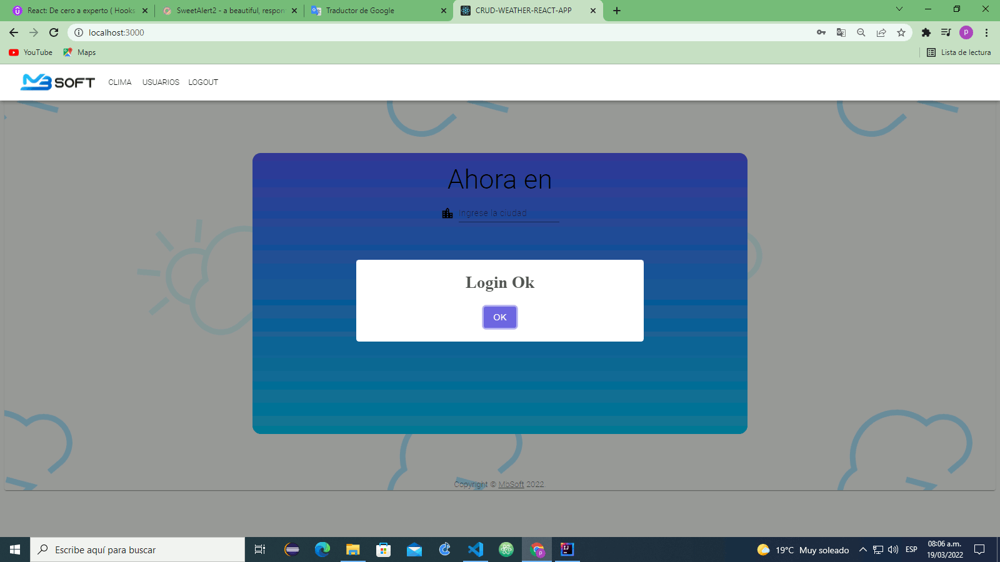

alert message error
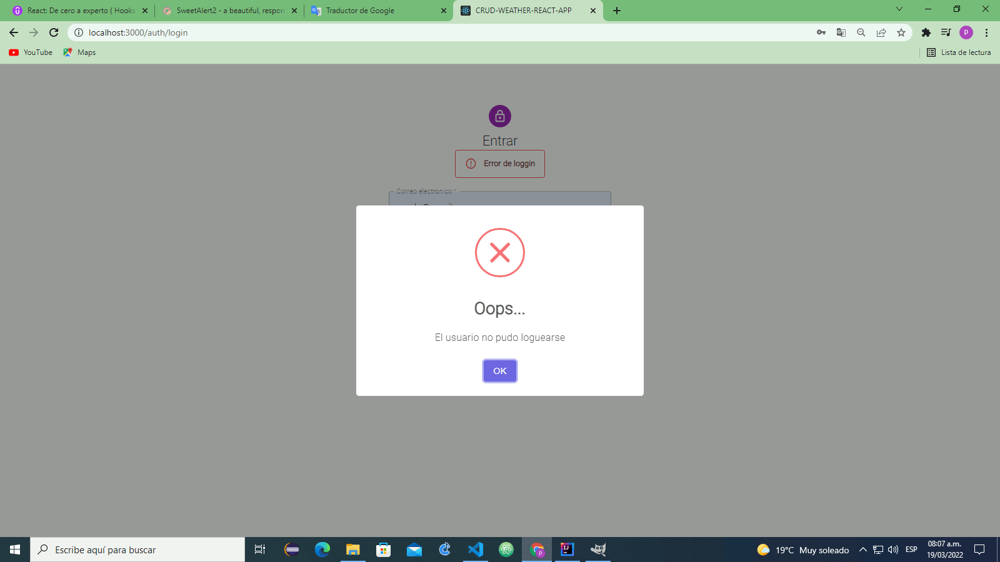

firebase deploy
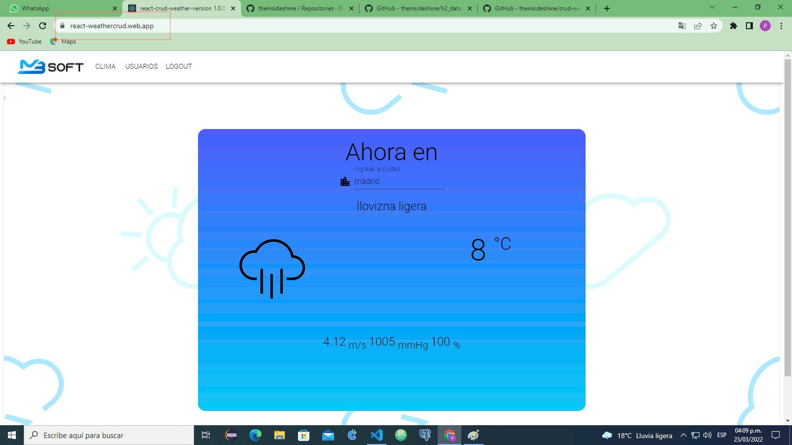

 

